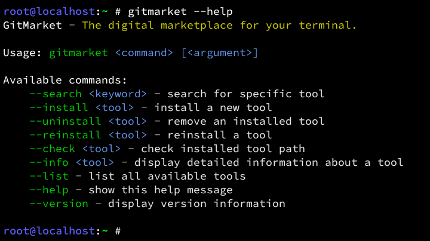
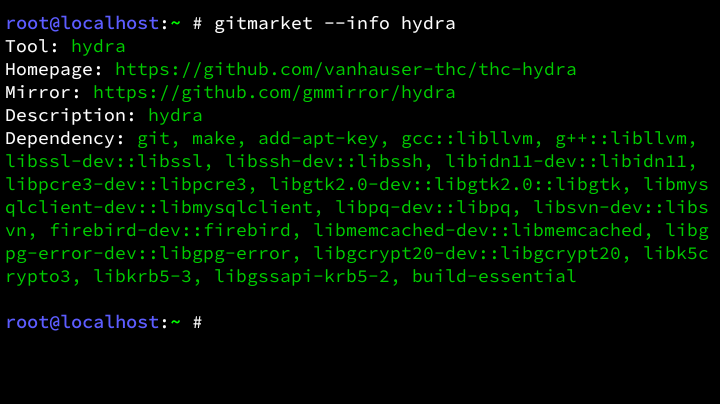
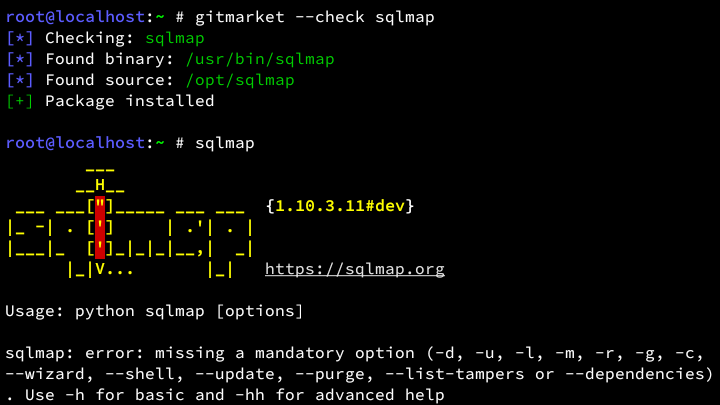

<!-- GitMarket Project -->

[]()
[]()
[]()
[](LICENSE)

# GitMarket
GitMarket is a powerful CLI-based marketplace designed to simplify how you find, install, and manage developer tools directly from your terminal. <br>
Built with speed and efficiency in mind, it bridges the gap between discovery and deployment.

## Preview
<details>
<summary>Show Preview</summary>
<br>

<br><br>

<br><br>

<br>
</details>

## Collections
<details>
<summary>Show collections</summary>

- [apktool](https://github.com/iBotPeaches/Apktool)
- [chprompt](https://github.com/Zeronetsec/Chprompt)
- [comet](https://github.com/Zeronetsec/Comet)
- [dalfox](https://github.com/hahwul/dalfox)
- [darksay](https://github.com/Blziko/darksay)
- [ffuf](https://github.com/ffuf/ffuf)
- [gobuster](https://github.com/Oj/gobuster)
- [gospel](https://github.com/Zeronetsec/Gospel)
- [holehe](https://github.com/megadose/holehe)
- [httpx](https://github.com/projectdiscovery/httpx)
- [hydra](https://github.com/vanhauser-thc/thc-hydra)
- [katana](https://github.com/projectdiscovery/katana)
- [metasploit](https://github.com/rapid7/metasploit-framework)
- [muxly](https://github.com/Zeronetsec/Muxly)
- [naabu](https://github.com/projectdiscovery/naabu)
- [neofetch](https://github.com/dylanaraps/neofetch)
- [nuclei](https://github.com/projectdiscovery/nuclei)
- [rubytask](https://github.com/Zeronetsec/Rubytask)
- [sqlmap](https://github.com/sqlmapproject/sqlmap)
- [subfinder](https://github.com/projectdiscovery/subfinder)
- [zphisher](https://github.com/htr-tech/zphisher)

</details>

## Features
- Global tool discovery across curated repositories
- Instant binary installation and automated setup
- Zero-trace tool removal and uninstallation
- Automated environment integrity and path checking
- In-depth metadata and package information retrieval
- Batch package listing and repository synchronization
- High-speed reinstallation for corrupted binaries

## Disclaimer
**GitMarket** is a powerful but simple **alternative** for your terminal. <br>
Use it **only** if your primary package manager (apt, apk, pacman, etc.) does not provide the tool you need. <br>
Installing the same package via both managers can **cause path conflicts.** <br>
Use this tool to **fill the gaps**, not as a full system replacement.

## Installation
```bash
git clone https://github.com/Zeronetsec/GitMarket.git
cd GitMarket
chmod +x install.sh
./install.sh

# for backup
./install.sh --backup
```

## Usage
```bash
gitmarket --search <keyword>
gitmarket --install <tool>
gitmarket --uninstall <tool>
gitmarket --reinstall <tool>
gitmarket --check <tool>
gitmarket --info <tool>
gitmarket --list
```

## License
This project is licensed under the MIT License. <br>

<!-- Copyright (c) 2026 Zeronetsec -->